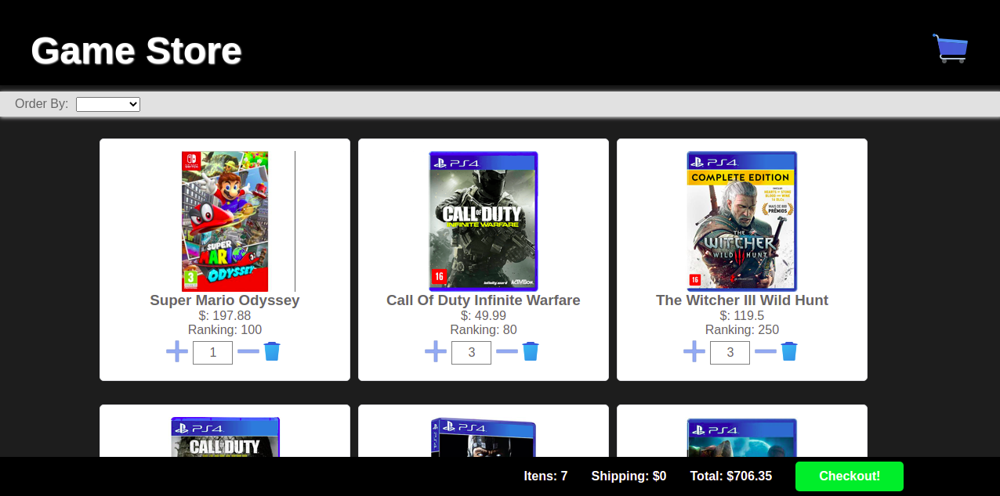
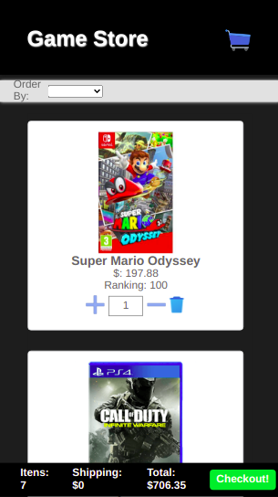

# Welcome to GameStore React App

Esse projeto pode ser acessado no seguinte link vercel: https://supera-challenge-iota.vercel.app/

#### Desktop / Mobile

<>

## O projeto

A proposta do projeto é montar um ecommerce usando react para web, consumindo dados de um arquivo JSON enviado pelo desafiante.

Os requisitos são:

- Os produtos devem ser renderizados dinamicamente através do products.json anexado, assets.zip anexados também
- Os valores exibidos no checkout (frete, subtotal e total) devem ser calculados dinamicamente
- O usuário poderá adicionar e remover produtos do carrinho
- O usuário poderá ordenar os produtos por preço, popularidade (score) e ordem alfabética.
- A cada produto adicionado, deve-se somar R$ 10,00 ao frete.
- O frete é grátis para compras acima de R$ 250,00.

